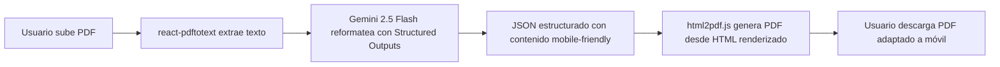
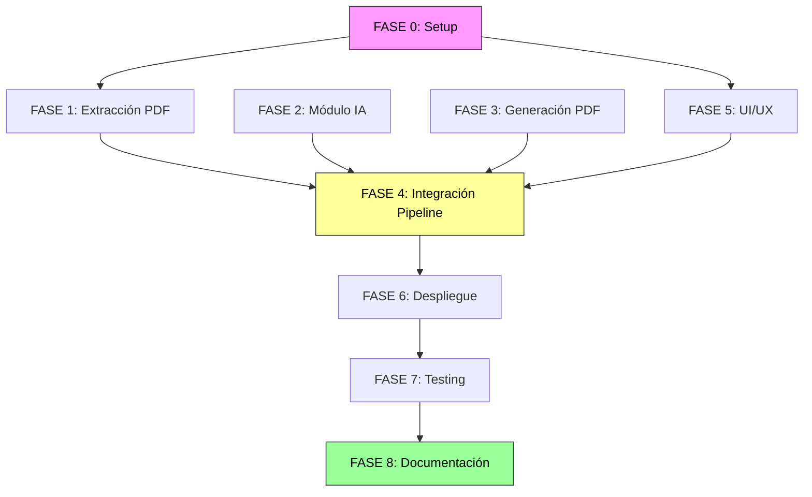

# PLAN DE IMPLEMENTACIÓN: PDF-to-Mobile Web App

> **Fecha:** 29 de Mayo de 2026
> **Proyecto:** Belen1
> **Basado en:** [validacion_viabilidad_pdf_to_mobile.md](investigaciones/validacion_viabilidad_pdf_to_mobile.md)
> **Arquitectura:** 100% client-side (React + Vite + TypeScript)
> **Hosting:** Render Static Site
> **Coste total:** $0/mes

---

## ARQUITECTURA DE REFERENCIA

```
┌──────────┐      ┌──────────────────┐      ┌─────────────────┐
│  USUARIO  │─────▶│  Render Static    │      │  Google Gemini   │
│ (Browser) │      │  (HTML+JS+CSS)    │─────▶│  API (2.5 Flash) │
│           │◀─────│  Sin backend      │◀─────│  10 RPM/250 RPD  │
└──────────┘      └──────────────────┘      └─────────────────┘
                         │                           │
                         │ (opcional)                │ (fallback)
                         ▼                           ▼
                  ┌─────────────┐          ┌──────────────────┐
                  │  Supabase    │          │  OpenRouter       │
                  │  Storage+DB  │          │  (modelos :free)  │
                  └─────────────┘          └──────────────────┘
```

**Pipeline de procesamiento (100% client-side):**



---

## STACK TECNOLÓGICO FINAL

| Capa | Tecnología | Versión | Coste |
|------|-----------|---------|-------|
| Frontend Framework | React + Vite + TypeScript | React 19, Vite 7 | $0 |
| Hosting | Render Static Site | — | $0 |
| Extracción PDF | `react-pdftotext` (pdf.js wrapper) | latest | $0 |
| IA Reformateo | Gemini 2.5 Flash API + Structured Outputs | gemini-2.5-flash | $0 (250 RPD) |
| IA Fallback | OpenRouter `:free` + Ollama local `gpt-oss-20b` | — | $0 |
| Generación PDF | `html2pdf.js` | 0.10.1 | $0 |
| Almacenamiento (opcional) | Supabase Storage + PostgreSQL | — | $0 |
| Estilos | Tailwind CSS | v4 | $0 |

---

## ESTRUCTURA DEL PROYECTO

```
belen1/
├── public/
│   └── favicon.svg
├── src/
│   ├── main.tsx                    # Entry point
│   ├── App.tsx                     # Root component + pipeline orchestrator
│   ├── index.css                   # Tailwind imports + global styles
│   ├── components/
│   │   ├── PdfUploader.tsx         # Drag & drop upload con previsualización
│   │   ├── TextPreview.tsx         # Vista previa del texto extraído
│   │   ├── ConversionProgress.tsx  # Barra de progreso + pasos del pipeline
│   │   ├── MobilePreview.tsx       # Vista previa del HTML mobile renderizado
│   │   ├── PdfDownload.tsx         # Botón de descarga + preview inline
│   │   └── ErrorBoundary.tsx       # Manejo de errores global
│   ├── services/
│   │   ├── pdfExtractor.ts         # Wrapper de react-pdftotext
│   │   ├── geminiApi.ts            # Cliente Gemini con Structured Outputs
│   │   ├── openRouterApi.ts        # Cliente OpenRouter fallback
│   │   ├── rateLimiter.ts          # Rate limiter (10 RPM = 6s entre requests)
│   │   └── pdfGenerator.ts         # Wrapper de html2pdf.js
│   ├── prompts/
│   │   └── mobileReformat.ts       # Prompt + JSON Schema para Gemini
│   ├── templates/
│   │   └── mobilePdfTemplate.ts    # HTML/CSS template mobile-first
│   ├── hooks/
│   │   ├── usePdfConversion.ts     # Hook principal del pipeline
│   │   └── useRateLimiter.ts       # Hook para gestión de rate limits
│   ├── types/
│   │   └── index.ts                # TypeScript interfaces compartidas
│   └── utils/
│       ├── charsetFixer.ts         # Corrección de encoding corrupto
│       └── textChunker.ts          # División de textos largos para el LLM
├── .env                            # Variables de entorno (API keys)
├── .env.example                    # Template sin secretos
├── .rooignore                      # Ya existe
├── index.html                      # Vite entry HTML
├── package.json
├── tsconfig.json
├── vite.config.ts
├── tailwind.config.ts
└── README.md
```

---

## FASES DE IMPLEMENTACIÓN

---

### FASE 0 — Setup del Proyecto

**Objetivo:** Dejar el proyecto listo para desarrollar con todas las dependencias instaladas y configuración base.

#### Tareas

| # | Tarea | Archivo(s) | Criterio de aceptación |
|---|-------|-----------|------------------------|
| 0.1 | Inicializar proyecto Vite + React + TypeScript | `package.json`, `vite.config.ts`, `tsconfig.json` | `npm run dev` arranca sin errores |
| 0.2 | Instalar dependencias de producción | `package.json` | `react-pdftotext`, `html2pdf.js`, `@google/generative-ai`, `openai` (para OpenRouter) instalados |
| 0.3 | Instalar dependencias de desarrollo | `package.json` | Tailwind CSS v4, ESLint, Prettier configurados |
| 0.4 | Crear `.env.example` con las claves necesarias | `.env.example` | Contiene `VITE_GEMINI_API_KEY=`, `VITE_OPENROUTER_API_KEY=`, `VITE_SUPABASE_URL=`, `VITE_SUPABASE_ANON_KEY=` |
| 0.5 | Configurar Tailwind CSS | `tailwind.config.ts`, `src/index.css` | Clases de Tailwind funcionan en componentes |
| 0.6 | Crear estructura de directorios | `src/components/`, `src/services/`, `src/hooks/`, `src/types/`, `src/prompts/`, `src/templates/`, `src/utils/` | Todos los directorios existen |
| 0.7 | Definir tipos TypeScript base | `src/types/index.ts` | Interfaces: `PdfConversionState`, `MobileContent`, `ConversionStep`, `GeminiResponse` |

---

### FASE 1 — Módulo de Extracción PDF

**Objetivo:** El usuario puede subir un PDF y ver el texto extraído en pantalla.

#### Tareas

| # | Tarea | Archivo(s) | Criterio de aceptación |
|---|-------|-----------|------------------------|
| 1.1 | Implementar `pdfExtractor.ts` — wrapper de `react-pdftotext` con soporte para ArrayBuffer | `src/services/pdfExtractor.ts` | Extrae texto de un PDF y devuelve `string` |
| 1.2 | Implementar `charsetFixer.ts` — detecta y corrige encoding corrupto (tildes, eñes) | `src/utils/charsetFixer.ts` | "Z�rich" → "Zürich", caracteres especiales preservados |
| 1.3 | Implementar `PdfUploader.tsx` — componente drag & drop + file input | `src/components/PdfUploader.tsx` | Acepta PDFs, muestra nombre/tamaño, rechaza no-PDFs |
| 1.4 | Implementar `TextPreview.tsx` — muestra el texto extraído en un contenedor scrollable | `src/components/TextPreview.tsx` | Texto visible tras extracción, scroll si es largo |
| 1.5 | Integrar Fase 1 en `App.tsx` — flujo: upload → extraer → mostrar | `src/App.tsx` | Pipeline parcial funcional: PDF → texto en pantalla |
| 1.6 | Test con el PDF real `Folleto-KNA10055-KANNAKEM-20260522153019-0-395.pdf` | N/A (test manual) | Texto extraído contiene itinerario, alojamientos, precios. Caracteres especiales correctos. |

---

### FASE 2 — Módulo de Inteligencia Artificial

**Objetivo:** El texto extraído se envía a Gemini 2.5 Flash y se recibe JSON estructurado con el contenido reformateado para móvil.

#### Tareas

| # | Tarea | Archivo(s) | Criterio de aceptación |
|---|-------|-----------|------------------------|
| 2.1 | Diseñar el prompt de transformación y el JSON Schema para Structured Outputs | `src/prompts/mobileReformat.ts` | Schema incluye: título, días (con emoji, resumen, bullets), alojamientos, servicios, número de página |
| 2.2 | Implementar `geminiApi.ts` — cliente Gemini con Structured Outputs (usando `@google/generative-ai`) | `src/services/geminiApi.ts` | Envía texto del PDF + prompt + schema, recibe JSON validado |
| 2.3 | Implementar `textChunker.ts` — divide textos largos si exceden el contexto del modelo | `src/utils/textChunker.ts` | PDFs de 4+ páginas se procesan en chunks si es necesario |
| 2.4 | Implementar `rateLimiter.ts` — asegura máx. 10 RPM (1 petición cada 6s) | `src/services/rateLimiter.ts` | Encola peticiones, muestra tiempo estimado de espera |
| 2.5 | Implementar `openRouterApi.ts` — cliente OpenRouter como fallback (usando SDK OpenAI-compatible) | `src/services/openRouterApi.ts` | Si Gemini falla (rate limit, error red, no disponible), usa OpenRouter automáticamente |
| 2.6 | Documentar setup de Ollama local como tercer fallback | `README.md` (sección desarrollo local) | Instrucciones claras: instalar Ollama, bajar `gpt-oss-20b`, configurar `OLLAMA_ORIGINS` |
| 2.7 | Test manual: enviar texto del PDF real y validar JSON de respuesta | N/A (test manual) | JSON contiene días resumidos con emojis, alojamientos agrupados, servicios en bullets |

---

### FASE 3 — Módulo de Generación PDF

**Objetivo:** El JSON estructurado se transforma en HTML y `html2pdf.js` genera el PDF final.

#### Tareas

| # | Tarea | Archivo(s) | Criterio de aceptación |
|---|-------|-----------|------------------------|
| 3.1 | Diseñar template HTML/CSS mobile-first (single-column, emojis, bullets, tipografía grande) | `src/templates/mobilePdfTemplate.ts` | Función que recibe `MobileContent` (JSON) y devuelve string HTML con estilos inline |
| 3.2 | Implementar `pdfGenerator.ts` — wrapper de `html2pdf.js` con configuración de página | `src/services/pdfGenerator.ts` | Genera PDF desde HTML. Config: A5, portrait, margen 8mm, pagebreak mode |
| 3.3 | Implementar `MobilePreview.tsx` — renderiza el HTML en un iframe/vista previa antes de generar PDF | `src/components/MobilePreview.tsx` | Muestra cómo quedará el PDF, scroll vertical simulando móvil |
| 3.4 | Implementar `PdfDownload.tsx` — botón de descarga + opción de vista previa | `src/components/PdfDownload.tsx` | Click descarga el PDF generado. Opcional: toggle preview/descarga |
| 3.5 | Test manual: generar PDF con datos mock (sin IA) y validar diseño | N/A (test manual) | PDF generado tiene emojis visibles, bullets, single-column. Similar al PDF de ejemplo. |
| 3.6 | Documentar limitación: texto rasterizado (no seleccionable) | `README.md` + comentario en `pdfGenerator.ts` | Advertencia visible sobre la limitación de `html2pdf.js` |

---

### FASE 4 — Integración del Pipeline Completo

**Objetivo:** Conectar las tres fases en un flujo único, de extremo a extremo.

#### Tareas

| # | Tarea | Archivo(s) | Criterio de aceptación |
|---|-------|-----------|------------------------|
| 4.1 | Implementar `usePdfConversion.ts` — hook que orquesta los 3 pasos con manejo de estado | `src/hooks/usePdfConversion.ts` | Estado: `idle → extracting → reformatting → generating → done`, con errores por paso |
| 4.2 | Implementar `ConversionProgress.tsx` — muestra los 3 pasos con iconos de estado (pending/loading/done/error) | `src/components/ConversionProgress.tsx` | Visualiza: [Extraer texto] → [IA reformateando] → [Generando PDF] |
| 4.3 | Integrar pipeline completo en `App.tsx` — flujo: upload → extract → reformat → generate → download | `src/App.tsx` | Usuario sube PDF y obtiene PDF convertido sin salir de la página |
| 4.4 | Implementar `ErrorBoundary.tsx` — captura errores en cualquier paso y muestra mensaje amigable | `src/components/ErrorBoundary.tsx` | Errores de red, rate limit, API key inválida → mensaje claro + posible solución |
| 4.5 | Implementar `useRateLimiter.ts` — hook que informa al usuario del tiempo de espera restante | `src/hooks/useRateLimiter.ts` | Muestra "Esperando X segundos por límite de API gratuita..." si se alcanza el rate limit |
| 4.6 | Test end-to-end con el PDF real | N/A (test manual) | PDF de agencia de viajes → PDF mobile-friendly descargable en < 2 minutos |

---

### FASE 5 — UI/UX

**Objetivo:** Interfaz moderna, responsive, con buen feedback visual en cada paso.

#### Tareas

| # | Tarea | Archivo(s) | Criterio de aceptación |
|---|-------|-----------|------------------------|
| 5.1 | Diseñar layout principal: header, área de upload, área de resultado | `src/App.tsx`, `src/index.css` | Layout limpio, mobile-first, Tailwind-styled |
| 5.2 | Estilizar `PdfUploader.tsx` — drag & drop con animación, icono PDF, progreso de subida | `src/components/PdfUploader.tsx` | Drop zone con borde dashed, se ilumina al arrastrar, muestra nombre y tamaño |
| 5.3 | Estilizar `ConversionProgress.tsx` — steps visuales con iconos y animaciones | `src/components/ConversionProgress.tsx` | Checkmarks verdes al completar, spinner al procesar, X roja al fallar |
| 5.4 | Estilizar `MobilePreview.tsx` — marco de teléfono simulado | `src/components/MobilePreview.tsx` | Preview envuelto en un mockup de teléfono (bordes redondeados, notch) |
| 5.5 | Estilizar `PdfDownload.tsx` — botón prominente con icono | `src/components/PdfDownload.tsx` | Botón primary grande, icono de descarga, texto "Descargar PDF adaptado" |
| 5.6 | Añadir favicon y meta tags | `public/favicon.svg`, `index.html` | Favicon visible en pestaña, title: "PDF-to-Mobile" |
| 5.7 | Añadir footer con info de coste ($0/mes) y tecnologías usadas | `src/App.tsx` | Footer sutil: "⚡ 100% gratuito · Procesado en tu navegador · Gemini 2.5 Flash" |

---

### FASE 6 — Despliegue en Render Static Site

**Objetivo:** App desplegada y accesible públicamente en Render Static Site.

#### Tareas

| # | Tarea | Archivo(s) | Criterio de aceptación |
|---|-------|-----------|------------------------|
| 6.1 | Configurar `vite.config.ts` para producción (base path, build options) | `vite.config.ts` | `npm run build` genera `dist/` optimizado |
| 6.2 | Configurar variables de entorno en Render Dashboard | Render Dashboard | `VITE_GEMINI_API_KEY` configurada en el proyecto de Render |
| 6.3 | Crear `render.yaml` (opcional, para deploy automático) | `render.yaml` | Configura Static Site: build command `npm run build`, publish dir `dist` |
| 6.4 | Conectar repositorio Git con Render y desplegar | N/A (operación manual en Render) | URL pública funciona, app carga sin errores |
| 6.5 | Verificar post-deploy: test de conversión completa en producción | N/A (test manual) | PDF subido desde la URL pública → PDF convertido descargable |
| 6.6 | Configurar GitHub Actions para health-check semanal (evitar pausa de Supabase si se usa) | `.github/workflows/health-check.yml` | Petición semanal automática a Supabase para mantener el proyecto activo |

---

### FASE 7 — Testing y Validación

**Objetivo:** Verificar que la app funciona correctamente con diferentes PDFs y condiciones.

#### Tareas

| # | Tarea | Archivo(s) | Criterio de aceptación |
|---|-------|-----------|------------------------|
| 7.1 | Test con el PDF de ejemplo principal (`Folleto-KNA10055...pdf`) | N/A (test manual) | Conversión completa, texto extraído correcto, JSON reformateado coherente, PDF generado similar al ejemplo |
| 7.2 | Test con PDF de más páginas (si existe) | N/A (test manual) | Chunking funciona, PDF generado completo |
| 7.3 | Test con PDF de una sola página | N/A (test manual) | Sin errores, conversión más rápida |
| 7.4 | Test de rate limiting: simular múltiples conversiones seguidas | N/A (test manual) | Rate limiter encola correctamente y muestra tiempos de espera |
| 7.5 | Test de fallback: desconectar Gemini y verificar que OpenRouter toma el relevo | N/A (test manual) | Mensaje "Gemini no disponible, usando OpenRouter..." visible |
| 7.6 | Test cross-browser: Chrome, Firefox, Edge, Safari (si disponible) | N/A (test manual) | Funciona en los 3 navegadores principales |
| 7.7 | Test responsive: verificar en viewport móvil, tablet, desktop | N/A (test manual) | UI se adapta correctamente a todos los tamaños |

---

### FASE 8 — Documentación Final

**Objetivo:** Documentación completa para desarrolladores y usuarios.

#### Tareas

| # | Tarea | Archivo(s) | Criterio de aceptación |
|---|-------|-----------|------------------------|
| 8.1 | Escribir `README.md` completo: descripción, stack, setup, deploy, limitaciones | `README.md` | Cualquier desarrollador puede clonar y ejecutar en local |
| 8.2 | Documentar limitación de texto rasterizado (`html2pdf.js`) | `README.md` | Sección "Known Limitations" explica que el texto no es seleccionable |
| 8.3 | Documentar instrucciones de desarrollo local con Ollama | `README.md` | Sección "Local Development" con pasos para instalar Ollama + GPT-OSS |
| 8.4 | Añadir badge de coste $0/mes al README | `README.md` | Badge visible: "Cost: $0/month" |
| 8.5 | Crear `.env.example` completo con comentarios | `.env.example` | Cada variable explicada: dónde conseguir la key, para qué sirve |
| 8.6 | Actualizar el Memory Bank (`.roo/memory_bank/`) con estado final del proyecto | `.roo/memory_bank/activeContext.md`, `.roo/memory_bank/progress.md` | Contexto y progreso reflejan el estado post-implementación |

---

## DEPENDENCIAS ENTRE FASES



- **Fases 1, 2, 3** pueden ejecutarse en paralelo (módulos independientes)
- **Fase 4** es el punto de integración crítico
- **Fase 5** puede solaparse con las fases 1-3
- **Fase 6** requiere que Fase 4 esté completa
- **Fase 7** requiere Fase 6 (test en producción)
- **Fase 8** cierra el proyecto

---

## RIESGOS TÉCNICOS Y MITIGACIONES

| Riesgo | Fase | Mitigación |
|--------|------|------------|
| Gemini API no disponible desde España | Fase 2 | Fallback automático a OpenRouter. Testear disponibilidad en paso 2.2 |
| Rate limit de Gemini (10 RPM) muy restrictivo para desarrollo | Fase 2 | Usar Ollama local durante desarrollo. Rate limiter informa al usuario. |
| `react-pdftotext` no extrae correctamente el PDF real | Fase 1 | Test con el PDF real en paso 1.6. Si falla, evaluar `pdf.js` directamente. |
| `html2pdf.js` no renderiza emojis correctamente | Fase 3 | Test en paso 3.5. Si falla, evaluar `pdfmake` como alternativa (requiere más trabajo). |
| Texto rasterizado inaceptable para el caso de uso | Fase 3 | Aceptado como trade-off del MVP. Migrar a `pdfmake` en v2 si es requisito. |
| Build de Vite falla en Render | Fase 6 | Verificar `vite.config.ts` y node version en Render. Testear build local antes de deploy. |

---

## PRÓXIMO PASO

Pasar a **modo Code** para ejecutar la **Fase 0 — Setup del Proyecto**.
