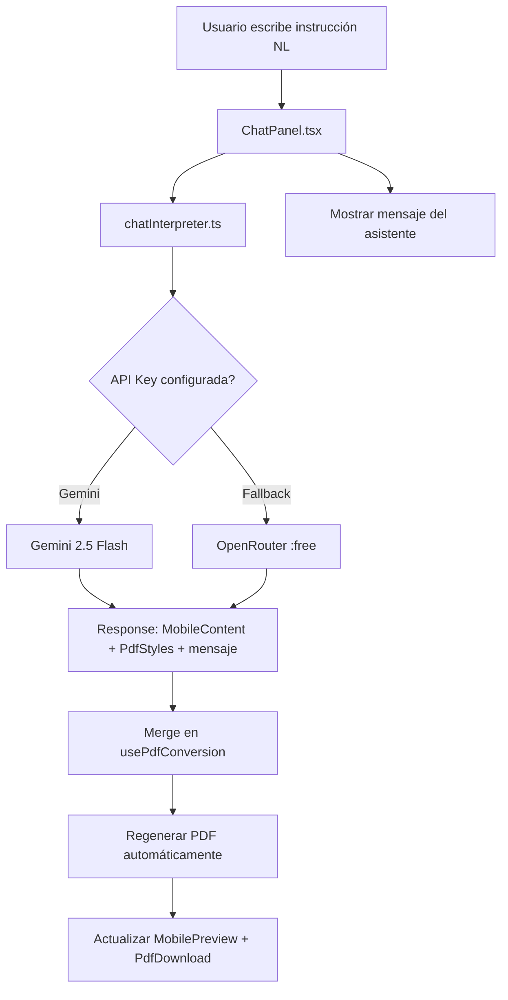
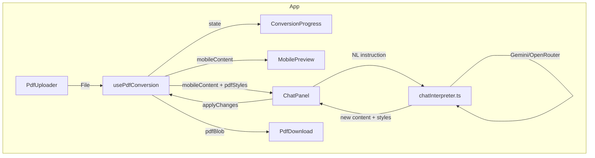

# Chat Interface Architecture Plan

## Contexto

El usuario rechazó el [`ContentEditor.tsx`](src/components/ContentEditor.tsx:1) basado en formularios (commit `6759b01`) y quiere una **interfaz de chat conversacional** donde instrucciones en lenguaje natural modifiquen el diseño y contenido del PDF, regenerándolo automáticamente. El PDF objetivo debe asemejarse al ejemplo [`ejemplo_como_debe_quedar_la_version_adatada_a_moviles.pdf`](ejemplo_como_debe_quedar_la_version_adatada_a_moviles.pdf).

---

## 1. Análisis del PDF de Ejemplo

Estructura extraída del dossier "ALSACIA Y PERLAS DE ALEMANIA":

| Elemento | Descripción |
|----------|-------------|
| **Título** | "ALSACIA Y PERLAS DE ALEMANIA" (mayúsculas, gran tamaño) |
| **Subtítulo** | "Dossier Exclusivo de Itinerario • 9 Días y 8 Noches" |
| **Precio** | "TARIFA DESDE 1.332€" (destacado, formato badge) |
| **Sección Itinerario** | 🗺️ ITINERARIO DE VIAJE → días con título, resumen, bullets |
| **Sección Servicios** | ✅ SERVICIOS INCLUIDOS → lista de inclusions |
| **Sección Alojamientos** | 🏨 ALOJAMIENTOS PREVISTOS → hotel + ciudad asociada |
| **Sección Comidas** | 🍽️ OPCIÓN COMIDAS PLUS → texto descriptivo |
| **Numeración** | Números de página al pie (1, 2, 3) |

El diseño usa iconos de sección, jerarquía tipográfica clara, y estructura de "dossier de agencia".

---

## 2. Arquitectura del Chat



### 2.1 Flujo de una interacción

1. Usuario escribe: _"pon el título en azul marino, usa fuente Georgia, y añade ✅ a cada día del itinerario"_
2. [`ChatPanel`](src/components/ChatPanel.tsx) construye el prompt con:
   - Mensaje del usuario
   - `MobileContent` actual (JSON completo)
   - `PdfStyles` actual (JSON completo)
   - Historial de los últimos N mensajes (para contexto conversacional)
3. [`chatInterpreter`](src/services/chatInterpreter.ts) llama a Gemini/OpenRouter
4. El LLM devuelve `{ content: MobileContent, styles: PdfStyles, message: string }`
5. Se aplican los cambios vía `setMobileContent()` + `setStyles()`
6. Se dispara `regeneratePdf()` automáticamente
7. El PDF y la preview se actualizan

### 2.2 Prompt del Intérprete (System Prompt)

```
Eres un editor de diseño de PDFs de viajes. Recibes:
1. Una instrucción en lenguaje natural del usuario
2. El contenido actual del documento en JSON
3. Los estilos visuales actuales en JSON

Tu tarea es aplicar la instrucción del usuario y devolver:
- El contenido COMPLETO modificado (MobileContent)
- Los estilos COMPLETOS modificados (PdfStyles)
- Un mensaje breve explicando qué cambiaste

REGLAS:
- Interpreta instrucciones de diseño: colores, fuentes, tamaños, layout
- Interpreta instrucciones de contenido: cambiar textos, añadir/quitar días, servicios, etc.
- Si el usuario pide "más grande", aumenta fontSize en 2px
- Si el usuario pide "más azul", ajusta colors hacia tonos azules
- Si el usuario pide una fuente, usa el valor CSS completo (ej: "'Georgia', serif")
- Para cambios de color, acepta nombres (rojo, azul marino, verde oscuro) y tradúcelos a hex
- Conserva TODO el contenido no mencionado, sin alterarlo
- NUNCA inventes datos nuevos a menos que el usuario lo pida explícitamente
```

### 2.3 Formato de Respuesta del LLM

```json
{
  "content": { /* MobileContent completo */ },
  "styles": { /* PdfStyles completo */ },
  "message": "He cambiado el título a azul marino (#1e3a5f), la fuente a Georgia, y añadido ✅ a los títulos de cada día."
}
```

---

## 3. Cambios en Tipos (`src/types/index.ts`)

### 3.1 Extender `PdfStyles`

```typescript
export interface PdfStyles {
  titleColor: string;
  headingColor: string;
  textColor: string;
  accentColor: string;
  backgroundColor: string;
  fontFamily: string;
  fontSize: number;
  // NUEVOS:
  priceColor?: string;        // Color del badge de precio
  subtitleColor?: string;     // Color del subtítulo
  dividerColor?: string;      // Color de separadores entre secciones
  cardBackground?: string;    // Fondo de cards de día/alojamiento
}
```

### 3.2 Nuevo tipo `ChatMessage`

```typescript
export interface ChatMessage {
  id: string;
  role: 'user' | 'assistant';
  text: string;
  timestamp: number;
}
```

---

## 4. Refactorización del Template (`src/templates/mobilePdfTemplate.ts`)

El template actual es minimalista. Debe refactorizarse para asemejarse al PDF de ejemplo:

### Cambios planeados

| Actual | Nuevo |
|--------|-------|
| Título `<h1>` simple | Título en mayúsculas + badge de precio + subtítulo con bullet `•` |
| Días planos | Cards de día con fondo suave, borde izquierdo de acento |
| Servicios como lista `<ul>` | Sección con icono ✅ y items con checkmarks |
| Alojamientos como texto | Cards con nombre de ciudad en negrita + hotel debajo |
| Notas genéricas | Sección con icono 📝 |
| Sin paginación | Número de página al pie (si `pageNumber` existe) |

### Estructura HTML objetivo

```
┌──────────────────────────────┐
│  ALSACIA Y PERLAS DE ALEMANIA │  ← title (MAYÚSCULAS, titleColor)
│  Dossier Exclusivo • 9 Días   │  ← subtitle (subtitleColor)
│  ┌────────────────────┐       │
│  │ TARIFA DESDE 1.332€ │       │  ← price badge (priceColor fondo)
│  └────────────────────┘       │
│                               │
│  🗺️ ITINERARIO DE VIAJE       │  ← section header (headingColor)
│  ┌─────────────────────────┐  │
│  │ Día 1 — Vuelo a Zúrich  │  │  ← day card (cardBackground)
│  │ Llegada a la ciudad...  │  │
│  │ • Traslado al hotel     │  │
│  │ • Tiempo libre          │  │
│  └─────────────────────────┘  │
│  ...                          │
│                               │
│  ✅ SERVICIOS INCLUIDOS        │
│  ✓ Vuelos ida y vuelta        │
│  ✓ 8 noches de hotel          │
│  ...                          │
│                               │
│  🏨 ALOJAMIENTOS PREVISTOS    │
│  Zúrich                       │
│  Mercure City / Intercity     │
│  ...                          │
│                               │
│                         [1]   │  ← page number
└──────────────────────────────┘
```

---

## 5. Nuevos Archivos

### 5.1 `src/services/chatInterpreter.ts`

Nuevo servicio que interpreta instrucciones de diseño en lenguaje natural.

```typescript
export async function interpretChatInstruction(
  userMessage: string,
  currentContent: MobileContent,
  currentStyles: PdfStyles,
  conversationHistory: ChatMessage[],
): Promise<{ content: MobileContent; styles: PdfStyles; message: string }>
```

- Usa Gemini 2.5 Flash (primario) con fallback a OpenRouter
- Prompt del sistema específico para edición de diseño
- Recibe el estado completo actual + historial
- Devuelve el estado completo modificado + mensaje explicativo

### 5.2 `src/components/ChatPanel.tsx`

Componente principal de la interfaz de chat.

**Props:**
```typescript
interface Props {
  content: MobileContent;
  styles: PdfStyles;
  onApplyChanges: (content: MobileContent, styles: PdfStyles) => void;
  isProcessing: boolean;
}
```

**Estado interno:**
- `messages: ChatMessage[]` — historial de la conversación
- `input: string` — texto actual del input
- `isLoading: boolean` — esperando respuesta del LLM

**UI:**
- Área de mensajes con scroll (burbujas estilo chat)
- Input con botón de enviar (o Enter)
- Indicador de "typing" (tres puntos animados) mientras se procesa
- Chips de sugerencias rápidas ("🎨 Cambiar colores", "🔤 Cambiar fuente", "📝 Editar título")
- Cada mensaje del asistente muestra un resumen de lo que cambió
- Altura fija (~400px) con scroll interno

### 5.3 `src/prompts/chatDesignInterpreter.ts`

Prompt del sistema para el intérprete de diseño.

---

## 6. Archivos a Modificar

### 6.1 `src/App.tsx`

| Cambio | Descripción |
|--------|-------------|
| Línea 5 | Reemplazar `import ContentEditor` por `import ChatPanel` |
| Líneas 74-83 | Reemplazar `<ContentEditor .../>` por `<ChatPanel .../>` |
| Nueva prop | Pasar `isProcessing` en lugar de `isRegenerating` |

### 6.2 `src/types/index.ts`

- Extender `PdfStyles` con 4 nuevas propiedades opcionales
- Añadir interfaz `ChatMessage`

### 6.3 `src/templates/mobilePdfTemplate.ts`

- Refactorizar `renderMobileTemplate()`: nuevo layout multi-sección
- Actualizar `DEFAULT_PDF_STYLES` con las nuevas propiedades

### 6.4 `src/hooks/usePdfConversion.ts`

- Añadir flag `isProcessing` al estado (para el ChatPanel)
- Auto-llamar `regeneratePdf()` tras `applyChatChanges()`

---

## 7. Eliminación

| Archivo | Acción |
|---------|--------|
| [`src/components/ContentEditor.tsx`](src/components/ContentEditor.tsx:1) | **ELIMINAR** — reemplazado por ChatPanel |

---

## 8. Diagrama de Componentes Final



---

## 9. Estrategia de Testing

1. Build TypeScript + Vite (0 errores)
2. Probar chat con instrucciones simples:
   - "cambia el color del título a #1a1a2e"
   - "usa fuente Georgia"
   - "el fondo que sea beige claro"
3. Probar chat con instrucciones de contenido:
   - "cambia el título a 'VIAJE A ALSACIA 2026'"
   - "añade un bullet al día 1: 'Visita guiada por la ciudad'"
4. Verificar que el PDF se regenera automáticamente tras cada cambio
5. Verificar que el historial de chat mantiene coherencia conversacional

---

## 10. Orden de Implementación

| # | Tarea | Depende de |
|---|-------|------------|
| 1 | Crear `ChatMessage` en types + extender `PdfStyles` | — |
| 2 | Refactorizar `renderMobileTemplate()` al nuevo diseño | #1 |
| 3 | Crear `chatDesignInterpreter.ts` (prompt) | — |
| 4 | Crear `chatInterpreter.ts` (servicio LLM) | #1, #3 |
| 5 | Actualizar `usePdfConversion` con `applyChatChanges()` | #1, #4 |
| 6 | Crear `ChatPanel.tsx` | #4, #5 |
| 7 | Actualizar `App.tsx` (reemplazar ContentEditor) | #6 |
| 8 | Eliminar `ContentEditor.tsx` | #7 |
| 9 | Build + test | #8 |
| 10 | Commit + memory bank | #9 |
