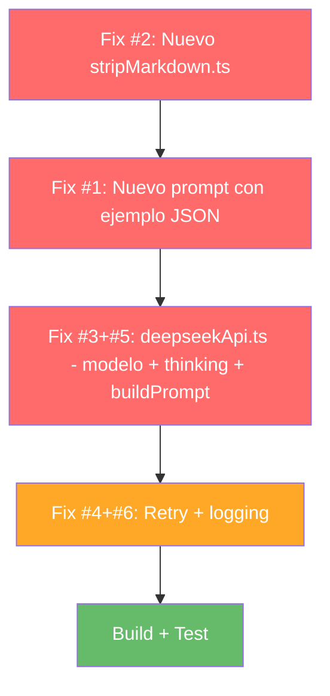

# Plan de Implementación: Fix DeepSeek JSON sin `title`

**Basado en:** [`investigaciones/diagnostico_deepseek_json_fallos.md`](../investigaciones/diagnostico_deepseek_json_fallos.md)
**Fecha:** 2026-05-30
**Modo objetivo:** 💻 Code (implementación directa, sin preguntas)

---

## Objetivo

Resolver el error `"IA devolvió respuesta sin título válido"` que ocurre en [`validateContent.ts:102`](src/utils/validateContent.ts:102) cuando DeepSeek API no incluye el campo `title` en el JSON. Aplicar los 5 fixes del diagnóstico en orden de dependencia.

---

## Flujo de Implementación



---

## Paso 1: Crear `src/utils/stripMarkdown.ts`

**Archivo:** Nuevo → `src/utils/stripMarkdown.ts`
**Dependencias:** Ninguna
**Fixes cubiertos:** #2 (strip markdown), #7 (strip BOM)

### Contenido exacto:

```typescript
/**
 * Utilidad para limpiar respuestas JSON de IA.
 *
 * DeepSeek API ocasionalmente envuelve el JSON en code fences markdown
 * (```json ... ```) o incluye BOM (\uFEFF) al inicio de la respuesta.
 * Esta función normaliza la respuesta antes del JSON.parse().
 */

export function stripMarkdownJson(raw: string): string {
  let cleaned = raw.trim();

  // Quitar BOM (Byte Order Mark) si existe — común en respuestas de IA
  if (cleaned.charCodeAt(0) === 0xFEFF) {
    cleaned = cleaned.slice(1).trim();
  }

  // Quitar ```json ... ``` o ``` ... ```
  const fenceMatch = cleaned.match(/^```(?:json)?\s*\n?([\s\S]*?)\n?```$/);
  if (fenceMatch) {
    cleaned = fenceMatch[1].trim();
  }

  return cleaned;
}

export default stripMarkdownJson;
```

### Verificación:
- Archivo creado en `src/utils/`
- `npm run build` no debe reportar errores de módulo no encontrado (aún no se importa)

---

## Paso 2: Reforzar `src/prompts/mobileReformat.ts`

**Archivo:** Modificar → [`src/prompts/mobileReformat.ts`](src/prompts/mobileReformat.ts)
**Dependencias:** Ninguna (cambios autocontenidos)
**Fixes cubiertos:** #1 (prompt con ejemplo JSON)

### Cambio:

Reemplazar TODO el contenido del archivo con:

```typescript
/**
 * Prompt + JSON Schema para Structured Outputs de Gemini/DeepSeek.
 * Diseñado para transformar texto de PDF de agencia de viajes en JSON mobile-friendly.
 *
 * ⚠️ IMPORTANTE: DeepSeek requiere la palabra "json" en el prompt Y un ejemplo
 * del objeto JSON esperado. Sin esto, el modelo puede omitir campos requeridos.
 * Ver: https://api-docs.deepseek.com/guides/json_mode
 */
export const MOBILE_REFORMAT_SYSTEM_PROMPT = `
Eres un asistente especializado en extraer datos en formato JSON de PDFs de agencias de viajes.
Tu única tarea es devolver un objeto JSON válido con esta estructura exacta:

{
  "title": "Nombre del viaje",
  "subtitle": "Nombre de la agencia",
  "days": [
    {
      "emoji": "🏖️",
      "title": "Día 1: Llegada a Zúrich",
      "summary": "Traslado y check-in en el hotel.",
      "bullets": ["Llegada al aeropuerto", "Traslado al hotel", "Cena libre"]
    }
  ],
  "accommodations": [
    {
      "name": "Hotel Ejemplo",
      "nights": "3 noches",
      "board": "AD",
      "location": "Zúrich"
    }
  ],
  "services": [
    { "category": "included", "items": ["Vuelos", "Traslados"] },
    { "category": "not_included", "items": ["Propinas", "Bebidas"] },
    { "category": "optional", "items": ["Excursión a los Alpes"] }
  ],
  "notes": ["Pasaporte en vigor", "Vacunas recomendadas"],
  "pageNumber": 1
}

Devuelve SOLO el JSON, sin markdown, sin code fences, sin texto adicional.

REGLAS:
1. Cada día del itinerario debe tener un emoji representativo (🏖️ playa, 🏔️ montaña, 🏛️ museo, 🚌 bus, ✈️ vuelo, etc.)
2. Resúmenes de 1-2 líneas máximo por día.
3. Bullets concisos (máx 8 palabras cada uno).
4. Agrupa alojamientos con nombre, noches, régimen y ubicación.
5. Clasifica servicios en: included, not_included, optional.
6. Ignora contenido irrelevante (términos legales extensos, pies de página repetitivos).
7. Conserva TODOS los datos factuales: precios, horarios, direcciones, teléfonos.
8. Si no encuentras ciertos datos (ej. alojamientos), omite el campo.
`;

export const MOBILE_REFORMAT_SCHEMA = {
  type: 'object' as const,
  properties: {
    title: { type: 'string', description: 'Título principal del viaje/paquete' },
    subtitle: { type: 'string', description: 'Subtítulo o nombre de la agencia' },
    days: {
      type: 'array',
      items: {
        type: 'object',
        properties: {
          emoji: { type: 'string', description: 'Emoji representativo del día' },
          title: { type: 'string', description: 'Título del día (ej: "Día 1: Llegada a Zúrich")' },
          summary: { type: 'string', description: 'Resumen de 1-2 líneas' },
          bullets: {
            type: 'array',
            items: { type: 'string' },
            description: 'Puntos clave del día (3-6 bullets)',
          },
        },
        required: ['emoji', 'title', 'summary', 'bullets'],
      },
      description: 'Días del itinerario',
    },
    accommodations: {
      type: 'array',
      items: {
        type: 'object',
        properties: {
          name: { type: 'string' },
          nights: { type: 'string' },
          board: { type: 'string', description: 'Régimen: AD, MP, PC, etc.' },
          location: { type: 'string' },
        },
        required: ['name', 'nights'],
      },
      description: 'Alojamientos del viaje',
    },
    services: {
      type: 'array',
      items: {
        type: 'object',
        properties: {
          category: { type: 'string', enum: ['included', 'not_included', 'optional'] },
          items: { type: 'array', items: { type: 'string' } },
        },
        required: ['category', 'items'],
      },
      description: 'Servicios clasificados por categoría',
    },
    notes: {
      type: 'array',
      items: { type: 'string' },
      description: 'Notas importantes (documentación, visados, propinas, etc.)',
    },
    pageNumber: { type: 'number', description: 'Número de páginas del PDF original' },
  },
  required: ['title', 'days'],
};
```

### Verificación:
- El prompt contiene la palabra "JSON" (5 veces) y la palabra "json" (1 vez)
- El prompt contiene un ejemplo completo del objeto esperado
- El prompt incluye "sin markdown, sin code fences"
- La regla 8 es nueva: "Si no encuentras ciertos datos, omite el campo"
- `MOBILE_REFORMAT_SCHEMA` no cambia (ya estaba correcto)

---

## Paso 3: Actualizar `src/services/deepseekApi.ts`

**Archivo:** Modificar → [`src/services/deepseekApi.ts`](src/services/deepseekApi.ts)
**Dependencias:** Fix #2 (`stripMarkdownJson` importado de `../utils/stripMarkdown`)
**Fixes cubiertos:** #3 (thinking disabled + modelo v4-flash), #5 (buildPrompt con JSON explícito), #4 (retry con backoff), #6 (logging finish_reason)

### Cambios:

**3a. Nuevo import:**
```typescript
import { stripMarkdownJson } from '../utils/stripMarkdown';
```
Añadir después del import de `validateMobileContent` (línea 5).

**3b. Actualizar `buildPrompt()` (Fix #5):**
```typescript
function buildPrompt(pdfText: string): string {
  return `Convierte el siguiente texto de PDF en el JSON estructurado descrito en el system prompt.

TEXTO DEL PDF A REFORMATEAR:
---
${pdfText}
---

Responde ÚNICAMENTE con el JSON, sin markdown ni texto adicional.`;
}
```

**3c. Reemplazar `reformatWithDeepSeek()` completo (Fixes #3, #4, #6):**
```typescript
/**
 * Reformatea texto de PDF usando DeepSeek V4 Flash.
 *
 * Pipeline: prompt con ejemplo → DeepSeek V4 Flash (thinking disabled) →
 * stripMarkdownJson() → validateMobileContent()
 *
 * Incluye retry con backoff (3 intentos) para empty content
 * (fallo documentado por DeepSeek como "ocasional").
 */
export async function reformatWithDeepSeek(pdfText: string): Promise<MobileContent> {
  if (isPrimaryAICircuitOpen()) {
    throw new Error('DeepSeek bloqueado por circuit breaker (demasiados fallos consecutivos)');
  }

  const openai = getClient();
  const MAX_ATTEMPTS = 3;
  let lastError: unknown;

  for (let attempt = 1; attempt <= MAX_ATTEMPTS; attempt++) {
    try {
      const result = await openai.chat.completions.create({
        model: 'deepseek-v4-flash', // actualizado desde 'deepseek-chat' (legacy, se retira Jul 2026)
        messages: [
          { role: 'system', content: MOBILE_REFORMAT_SYSTEM_PROMPT },
          { role: 'user', content: buildPrompt(pdfText) },
        ],
        temperature: 0.3,
        max_tokens: 8192,
        response_format: { type: 'json_object' },
        // Deshabilitar thinking mode: la extracción JSON no necesita razonamiento
        extra_body: { thinking: { type: 'disabled' } },
      });

      const finishReason = result.choices[0]?.finish_reason;
      const rawJson = result.choices[0]?.message?.content;

      console.log(
        `[DeepSeek] Intento ${attempt}: finish_reason=${finishReason}, content_length=${rawJson?.length ?? 0}`,
      );

      // Empty content: reintentar con backoff
      if (!rawJson) {
        console.warn(`[DeepSeek] Intento ${attempt}: respuesta vacía`);
        if (attempt < MAX_ATTEMPTS) {
          await new Promise(r => setTimeout(r, 1000 * attempt));
          continue;
        }
        throw new Error('DeepSeek devolvió respuesta vacía tras 3 intentos');
      }

      // Limpiar markdown fences y BOM antes de parsear
      const cleaned = stripMarkdownJson(rawJson);
      console.log('[DeepSeek] JSON limpio (primeros 200 chars):', cleaned.substring(0, 200));

      const parsed = validateMobileContent(JSON.parse(cleaned));
      recordPrimaryAISuccess();
      return parsed;

    } catch (err) {
      lastError = err;
      // Error de validación: no reintentar (datos corruptos, no transitorio)
      if (err instanceof Error && err.message.includes('IA devolvió')) {
        throw err;
      }
      // Otros errores (red, rate-limit, etc.): reintentar
      if (attempt < MAX_ATTEMPTS) {
        console.warn(
          `[DeepSeek] Intento ${attempt} falló, reintentando en ${attempt}s...`,
          String(err).slice(0, 120),
        );
        await new Promise(r => setTimeout(r, 1000 * attempt));
      }
    }
  }

  throw lastError;
}
```

### Verificación:
- El import de `stripMarkdownJson` está presente
- `model: 'deepseek-v4-flash'` reemplaza a `'deepseek-chat'`
- `extra_body: { thinking: { type: 'disabled' } }` está presente
- `buildPrompt()` incluye la palabra "JSON" en mayúscula
- Bucle `for` con 3 intentos y backoff exponencial
- Logging de `finish_reason` y `content_length`
- No reintenta errores de validación (`IA devolvió...`)

---

## Paso 4: Build + Test

```bash
npm run build
```

### Criterios de éxito:
1. `tsc -b && vite build` completa sin errores
2. No hay imports no resueltos
3. No hay tipos incompatibles (especialmente `extra_body`)

### Test manual:
1. Abrir la app en `npm run dev`
2. Subir un PDF de agencia de viajes
3. Verificar en consola:
   - `[DeepSeek] Intento 1: finish_reason=stop, content_length=XXX`
   - `[DeepSeek] JSON limpio (primeros 200 chars): {"title":"...`
4. Verificar que NO aparece: `[usePdfConversion] DeepSeek falló, intentando OpenRouter fallback...`
5. El PDF generado debe tener título y días correctamente formateados

---

## Resumen de Archivos Afectados

| Archivo | Operación | Fixes |
|---------|-----------|-------|
| `src/utils/stripMarkdown.ts` | **CREAR** | #2, #7 |
| `src/prompts/mobileReformat.ts` | **MODIFICAR** | #1 |
| `src/services/deepseekApi.ts` | **MODIFICAR** | #3, #4, #5, #6 |

Total: 1 archivo nuevo, 2 archivos modificados.

---

## Rollback

Si algo falla en producción:

1. Revertir `deepseekApi.ts` a `model: 'deepseek-chat'`
2. Quitar `extra_body: { thinking: { type: 'disabled' } }`
3. El fallback a OpenRouter seguirá funcionando como red de seguridad
